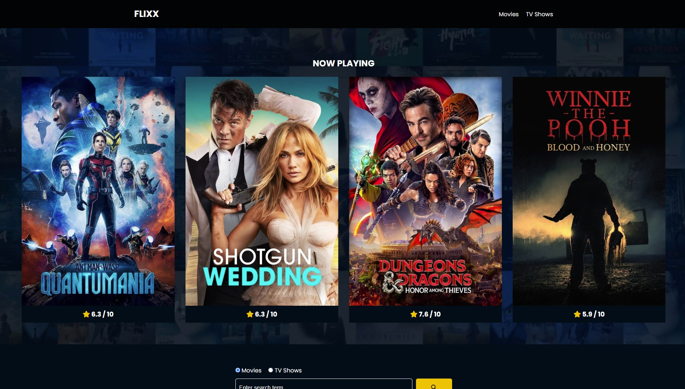
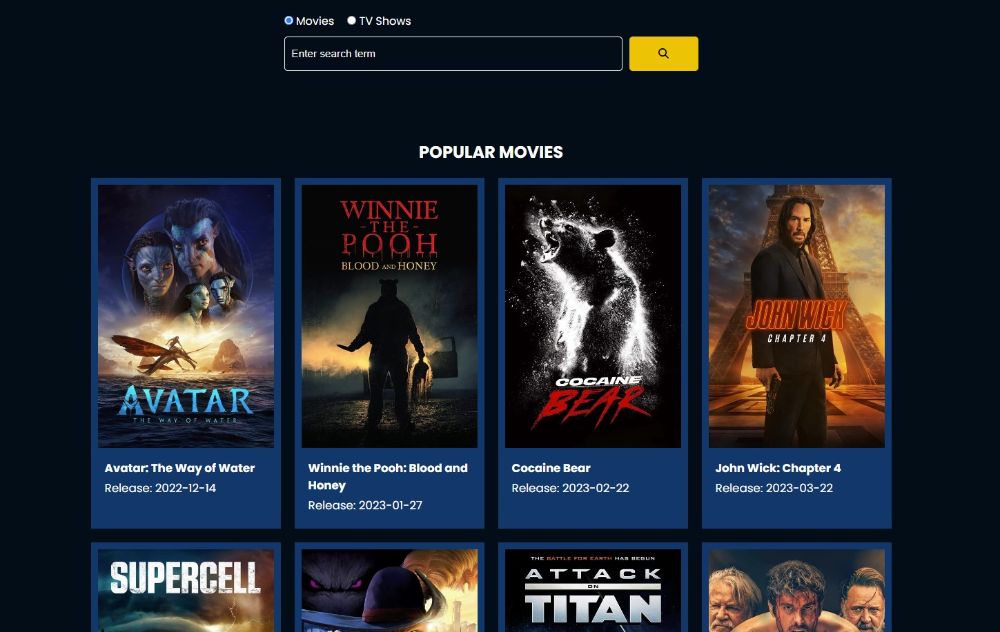
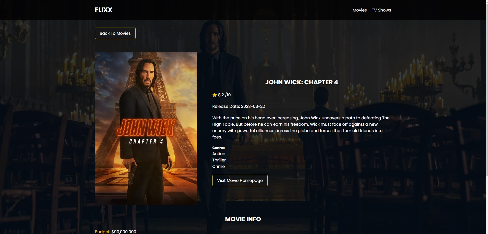

#Flixx App

Movie info application build with vanilla JavaScript that uses **version 3* of the [TMDB API](https://developers.themoviedb.org/3)

###Slider

###Search box

###Details page

This include the most popular movies and TV shows with detail page, a search box for movies and shows with full pagination and a slider for movies that are currently playing in theaters. The slider uses the [Swiper](https://swiperjs.com) library.
